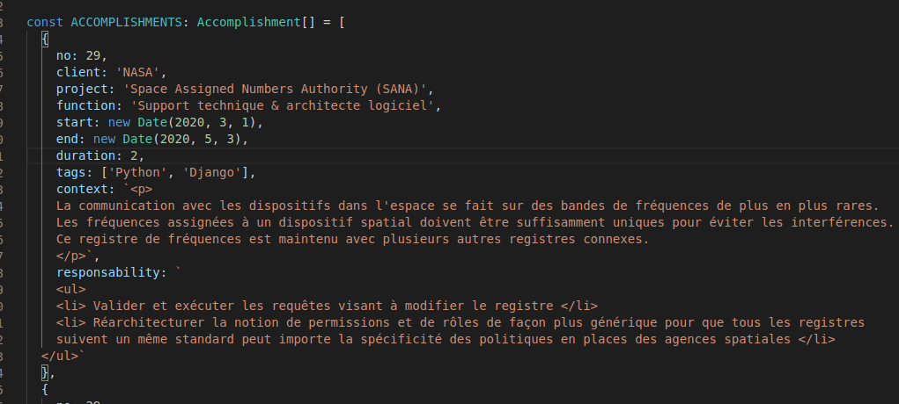
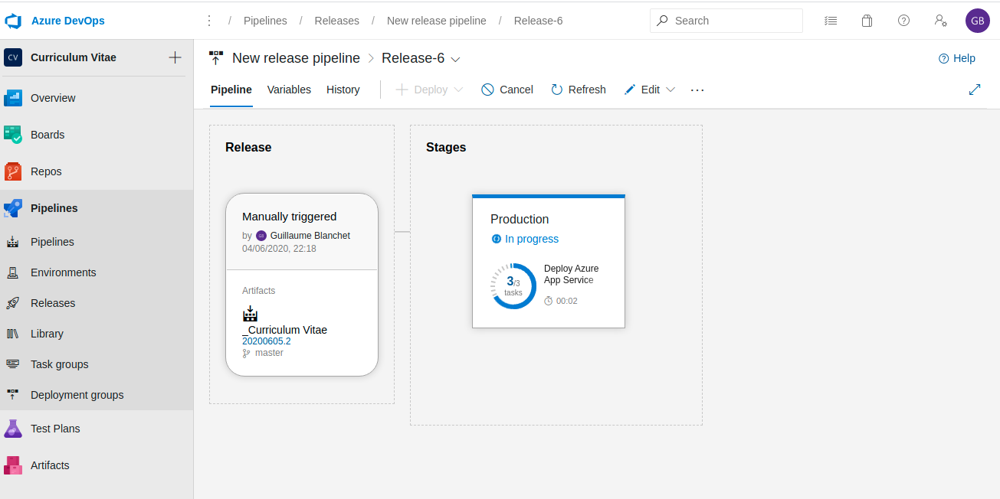

# C.V.

This project helps you create an outstanding curriculum vitae easily deployed online. By default, it is my curriculum, so
please update html files with your relevant experiences in the following folders:
    - carrer-summary
    - education
    - honors
    - publications

This project generate a c.v. tailored for consulting services from the JSON experiences "form" you enter in experience.service.ts:

[LIVE DEMO HERE](https://gblanchet.azurewebsites.net/) with my experience.

If you are not a consultant, you can maybe drop the detailed section about the experience with all the clients.

## Installing & running locally

    git clone https://github.com/GuillaumeBlanchet/curriculum-vitae.git
    cd curriculum-vitae
    ng serve -o

## Prerequisites

You need NodeJs & Git installed on your machine. This is an Angular 2+ project (don't care about the exact version, it's sooooo simple).

## Deployment

The project contains already a "azure-pipelines.yml" so that you can easily deploy it with Azure DevOps:

## Contribute

Feel free to contribute to the project. I am glad to receive suggestions/pull-requests.